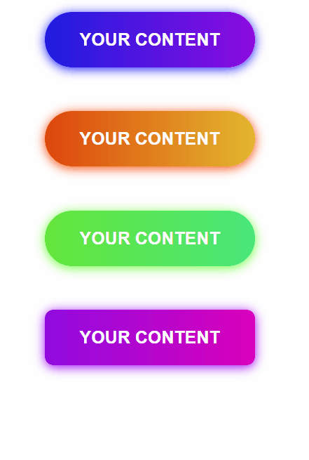

# Gradient Button for react



### Dependencies
- React
- ReactDOM
- Styled-components

### Tutorial

```javascript
import {GradientButton} from "react-simple-gradient-button"

class App extends Component {
  render() {
    return (
      <div className="App">
        <GradientButton />
      </div>
    );
  }
}
```

which displays


### Parameters

The GradientButton Component accepts a couple of different properties:

* Name: `text`  
Type: `String`  
Default: `Dummy`  
Description: The naming of the button.

* Name: `fontSize`  
Type: `Number`  
Default: `20`  
Description: Size of the button text in pixel.

* Name: `fontFamily`  
Type: `String`  
Default: `Arial`  
Description: The font family of the text. Could something like Arial, Trebuchet MS etc.

* Name: `borderRadius`  
Type: `Number`  
Default: `50`  
Description: The border radius of the button in pixel. Use this to change the appearance of the button from round to normal.

* Name: `gradientColor`  
Type: `Object`  
Default: `{
    left: 0,
    mid: 40,
    right: 80
}`  
Description: This is the gradientColor which makes the button look so nice. It accepts a object which has 3 properties. Those are `left`, `mid` and `right`. They all accept `Number` type values. They represent the "breakpoints" of the gradient.

The system on which the buttons are build upon are using hsla color values. so a value from `0` to `360` is considered.

A nice tool that helped me developing (and that might help you) is the hsl color picker: [hslpicker.com](http://hslpicker.com/)

Apart from that it's also possible to only specify the `left` property. The other 2 properties would then be filled out by using the `left` value.

For example `{left: 100}` would mean `{left: 100, mid: 140, right: 180}`.

### Some examples
 ```javascript
 <div className="App">
    <GradientButton />
    <GradientButton gradientColor={{left: 100}} />
    <GradientButton gradientColor={{left: 100, mid: 200, right: 300}} />
    <GradientButton text={"Subscribe"} fontFamily={"Trebuchet MS"} gradientColor={{left: 200, mid: 250, right: 300}}/>
</div>
 ```


